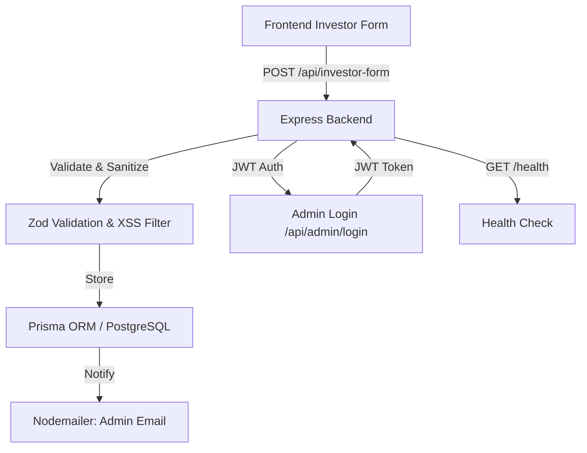

# Investor Form Backend

A production-ready Express.js + TypeScript backend for handling investor form submissions, with Supabase (PostgreSQL), Prisma ORM, Nodemailer email notifications, Zod validation, and robust security.

---

## 🚀 Features
- Express.js with TypeScript
- Supabase PostgreSQL via Prisma ORM
- Nodemailer (Gmail SMTP) for email notifications
- Zod for server-side validation
- Rate limiting, input sanitization, CORS, and security best practices
- Structured error handling and logging
- Health check and graceful shutdown

---

## 🛠️ Setup & Installation

1. **Clone the repository**
2. **Install dependencies:**
   ```sh
   npm install
   ```
3. **Configure environment variables:**
   - Copy `.env.example` to `.env` and fill in your values.
4. **Set up the database:**
   ```sh
   npx prisma generate
   npx prisma db push
   npx prisma studio # (optional, to view/manage data)
   ```
5. **Run the development server:**
   ```sh
   npm run dev
   ```

---

## 📦 Project Structure
```
src/
├── index.ts
├── routes/
│   └── investor.ts
├── middleware/
│   ├── validation.ts
│   ├── rateLimiter.ts
│   └── errorHandler.ts
├── services/
│   ├── database.ts
│   ├── email.ts
│   └── validation.ts
├── types/
│   └── investor.ts
└── utils/
    └── constants.ts
```

---

## 📝 API Documentation

### POST `/api/investor-form`
- **Description:** Submit investor inquiry form
- **Request Body:**
  ```json
  {
    "fullName": "John Doe",
    "phoneNumber": "+1234567890",
    "investmentPackage": "Starter",
    "city": "New York"
  }
  ```
- **Success Response:**
  ```json
  {
    "success": true,
    "message": "Submission received",
    "data": {
      "id": "uuid",
      "createdAt": "2024-06-01T12:00:00.000Z"
    }
  }
  ```
- **Validation Error Response:**
  ```json
  {
    "success": false,
    "error": "Validation failed",
    "details": [
      { "path": ["fullName"], "message": "Full Name must be at least 2 characters" }
    ]
  }
  ```
- **Rate Limit Error:**
  ```json
  {
    "success": false,
    "error": "Too many requests, please try again later."
  }
  ```

### Health Check
- **GET `/health`**
  - Returns `{ status: 'ok', message: 'API is healthy' }`

---

## 🔒 Security
- CORS: Only allows requests from your frontend URL
- Rate limiting: 5 requests/minute per IP
- Input sanitization: Prevents XSS
- Helmet: Sets secure HTTP headers
- Centralized error handling

---

## 🧪 Testing Guide

### Using curl
```sh
curl -X POST http://localhost:4000/api/investor-form \
  -H "Content-Type: application/json" \
  -d '{
    "fullName": "Jane Smith",
    "phoneNumber": "+15551234567",
    "investmentPackage": "Starter",
    "city": "San Francisco"
  }'
```

### Using Postman
- Import the endpoint and use the sample request body above.

### Error Scenarios
- Missing fields: Returns 400 with validation errors
- Invalid phone: Returns 400 with phone format error
- Too many requests: Returns 429
- Missing env vars: Server will not start

---

## ⚙️ Deployment
- Deploy on Railway, Render, or similar
- Set all environment variables in your deployment dashboard
- Ensure CORS is set to your frontend domain

---

## 🧩 Environment Variables
See `.env.example` for all required variables.

---

## 📝 Notes
- Emails are sent to the company admin (no investor email field)
- Prisma manages DB schema and migrations
- All responses are JSON and compatible with Next.js frontend

---

## 📚 Further Improvements
- Add investor email field for direct confirmation
- Add admin dashboard for submissions
- Add authentication for admin endpoints

---

## 👨‍💻 Author & License
- MIT License 

## JWT Authentication Setup

### 1. Environment Variables
Add the following to your `.env` file:

```
JWT_SECRET=your-very-strong-secret
ADMIN_USERNAME=your-admin-username
ADMIN_PASSWORD_HASH=your-bcrypt-hash
```

- Generate `ADMIN_PASSWORD_HASH` using bcryptjs:
  ```js
  // Run this in a Node.js REPL or script
  const bcrypt = require('bcryptjs');
  bcrypt.hash('your-password', 12).then(console.log);
  ```
  Copy the output to `ADMIN_PASSWORD_HASH` in your `.env`.

### 2. Endpoints
- `POST /api/admin/login` — Accepts `{ username, password }` and returns `{ token }` if valid.
- All `/api/investor-form` routes are now protected and require a valid JWT in the `Authorization: Bearer <token>` header.

### 3. Dependencies
Install required packages:
```
npm install jsonwebtoken bcryptjs @types/jsonwebtoken @types/bcryptjs --save
```

### 4. Usage
- Login as admin to get a JWT token.
- Use the token in the `Authorization` header to access protected routes. 

---

# 📖 Comprehensive Project Analysis & Documentation

## Overview

**Investor Form Backend** is a production-ready Express.js + TypeScript backend designed to handle investor inquiry form submissions. It is built with a focus on security, validation, and reliability, and is intended to be used as the backend for a web-based investor inquiry form.

### Key Technologies

- **Express.js** (with TypeScript): Web server and routing
- **Prisma ORM**: Database access and schema management (PostgreSQL via Supabase)
- **Nodemailer**: Email notifications (Gmail SMTP)
- **Zod**: Input validation
- **Security**: Helmet, CORS, rate limiting, input sanitization (XSS)
- **JWT Authentication**: For admin endpoints

---

## Features

- **Investor Form Submission**: Accepts investor details, validates, stores in DB, and notifies admin via email.
- **Admin Authentication**: JWT-based login for admin endpoints.
- **Health Check Endpoint**: For monitoring and deployment readiness.
- **Security Best Practices**: CORS, rate limiting, input sanitization, secure headers.
- **Centralized Error Handling**: Consistent error responses.
- **Environment Variable Validation**: Ensures all required configuration is present at startup.

---

## Project Structure

```
src/
├── index.ts                # Main server entry point
├── routes/
│   ├── investor.ts         # Investor form API routes
│   └── admin.ts            # Admin authentication routes
├── middleware/
│   ├── errorHandler.ts     # Centralized error handler
│   ├── jwtAuth.ts          # JWT authentication middleware
│   ├── rateLimiter.ts      # Rate limiting middleware
│   └── validation.ts       # Zod validation schema
├── services/
│   ├── database.ts         # Prisma client instance
│   ├── email.ts            # Email sending logic
│   └── validation.ts       # Environment variable validation
├── types/
│   └── investor.ts         # TypeScript types for investor form
└── utils/
    └── constants.ts        # Project-wide constants
```

---

## API Endpoints

### 1. Investor Form Submission

- **POST `/api/investor-form`**
  - **Request Body:**
    ```json
    {
      "fullName": "John Doe",
      "phoneNumber": "+1234567890",
      "investmentPackage": "Starter",
      "city": "New York"
    }
    ```
  - **Success Response:**
    ```json
    {
      "success": true,
      "message": "Submission received",
      "data": {
        "id": "uuid",
        "createdAt": "2024-06-01T12:00:00.000Z"
      }
    }
    ```
  - **Validation Error Response:**
    ```json
    {
      "success": false,
      "error": "Validation failed",
      "details": [
        { "path": ["fullName"], "message": "Full Name must be at least 2 characters" }
      ]
    }
    ```
  - **Rate Limit Error:**
    ```json
    {
      "success": false,
      "error": "Too many requests, please try again later."
    }
    ```

### 2. Admin Authentication

- **POST `/api/admin/login`**
  - **Request Body:**
    ```json
    {
      "username": "admin",
      "password": "your-password"
    }
    ```
  - **Success Response:**
    ```json
    {
      "success": true,
      "token": "jwt-token"
    }
    ```
  - **Error Response:** Invalid credentials or missing fields.

### 3. Health Check

- **GET `/health`**
  - **Response:**
    ```json
    { "status": "ok", "message": "API is healthy" }
    ```

---

## Security

- **CORS**: Only allows requests from whitelisted frontend URLs.
- **Rate Limiting**: 5 requests/minute per IP.
- **Input Sanitization**: Prevents XSS via the `xss` package.
- **Helmet**: Sets secure HTTP headers.
- **JWT Authentication**: Protects admin endpoints.
- **Centralized Error Handling**: All errors are caught and returned in a consistent JSON format.

---

## Database Schema

**Prisma Model: `Investor`**
- `id`: UUID (primary key)
- `fullName`: String
- `phoneNumber`: String (optional)
- `investmentPackage`: String
- `city`: String
- `submissionStatus`: String (default: "received")
- `createdAt`: DateTime (auto)
- `updatedAt`: DateTime (auto)
- `emailSentToAdmin`: Boolean (default: false)
- `emailSentToInvestor`: Boolean (default: false)

---

## Email Notifications

- **Admin Notification**: When a new investor form is submitted, an email is sent to the company admin with the details.
- **Investor Confirmation**: (Planned) Confirmation email to the investor (currently not implemented).

---

## Environment Variables

Required variables (see `.env.example`):

- `DATABASE_URL`
- `EMAIL_SERVICE_USER`
- `EMAIL_SERVICE_PASS`
- `COMPANY_ADMIN_EMAIL`
- `COMPANY_NAME`
- `FRONTEND_URL`
- `JWT_SECRET`
- `ADMIN_USERNAME`
- `ADMIN_PASSWORD_HASH`

---

## Setup & Installation

1. Clone the repository.
2. Install dependencies: `npm install`
3. Configure environment variables: Copy `.env.example` to `.env` and fill in your values.
4. Set up the database:
   - `npx prisma generate`
   - `npx prisma db push`
   - `npx prisma studio` (optional)
5. Run the development server: `npm run dev`

---

## Testing

- Use `curl` or Postman to test the `/api/investor-form` endpoint.
- Test admin login via `/api/admin/login`.
- Check `/health` for server status.

---

## Deployment

- Deploy on platforms like Railway, Render, or similar.
- Set all environment variables in your deployment dashboard.
- Ensure CORS is set to your frontend domain.

---

## Further Improvements (from README)

- Add investor email field for direct confirmation.
- Add admin dashboard for submissions.
- Add authentication for admin endpoints.

---

## Summary Diagram



---

## Conclusion

This backend is a robust, secure, and production-ready solution for handling investor form submissions, with a clear structure and best practices in place for validation, security, and maintainability. It is easily extensible for future features such as investor email confirmations and admin dashboards.

If you need a more detailed breakdown of any specific part (e.g., code walkthrough, security audit, or extension guide), let me know! 

## Complete API Endpoints

### 1. **POST `/api/investor-form`** - Submit New Investor Form
- Public endpoint for form submissions
- Validates input, stores in DB, sends admin email

### 2. **GET `/api/investor-form`** - Retrieve All Submissions  
- **Protected endpoint** (requires JWT authentication)
- Returns list of all investor submissions
- Includes all fields: id, fullName, phoneNumber, investmentPackage, city, submissionStatus, timestamps, email tracking

### 3. **POST `/api/admin/login`** - Admin Authentication
- Generates JWT token for admin access
- Required for accessing the GET endpoint

### 4. **GET `/health`** - Health Check
- Public monitoring endpoint

## Updated Architecture Flow
The diagram now makes complete sense - you have a full CRUD-like system where:
- **Public users** can submit forms (POST)
- **Admins** can authenticate and view all submissions (GET)
- **System monitoring** via health checks

This is a well-rounded backend that supports both the public-facing form submission and admin management functionality. The JWT authentication properly protects the sensitive GET endpoint that retrieves all investor data.

Is this GET endpoint part of an admin dashboard you're building, or are you planning to create one? This setup would work perfectly for an admin interface to manage and review investor inquiries. 

## InvestorAdmin API Documentation

---

### 1. Get All Admin Leads

**Endpoint:**
```
GET /api/admin/investor-admin
```
**Headers:**
- Authorization: Bearer <admin-jwt-token>

**Response Example:**
```json
{
  "success": true,
  "data": [
    {
      "id": "uuid",
      "fullName": "Jane Smith",
      "phoneNumber": "+15551234567",
      "investmentPackage": "Pro",
      "city": "San Francisco",
      "submissionStatus": "received",
      "createdAt": "2025-07-14T13:07:54.666Z",
      "updatedAt": "2025-07-14T13:07:54.666Z",
      "emailSentToAdmin": false,
      "emailSentToInvestor": false,
      "notes": "VIP lead",
      "callingTimes": 0,
      "leadStatus": "new",
      "originalInvestorId": "original-investor-uuid"
    }
  ]
}
```

---

### 2. Create a New Admin Lead

**Endpoint:**
```
POST /api/admin/investor-admin
```
**Headers:**
- Authorization: Bearer <admin-jwt-token>
- Content-Type: application/json

**Request Body Example:**
```json
{
  "fullName": "Jane Smith",
  "phoneNumber": "+15551234567",
  "investmentPackage": "Pro",
  "city": "San Francisco",
  "notes": "VIP lead",
  "callingTimes": 0,
  "leadStatus": "new",
  "originalInvestorId": "original-investor-uuid"
}
```

**Response Example:**
```json
{
  "success": true,
  "data": { /* ...created record... */ }
}
```

---

### 3. Update an Admin Lead

**Endpoint:**
```
PUT /api/admin/investor-admin/:id
```
**Headers:**
- Authorization: Bearer <admin-jwt-token>
- Content-Type: application/json

**Request Body Example:**
```json
{
  "notes": "Called, not interested",
  "callingTimes": 1,
  "leadStatus": "not_interested"
}
```

**Response Example:**
```json
{
  "success": true,
  "data": { /* ...updated record... */ }
}
```

---

### 4. Transfer Public Investor to Admin Lead

**Endpoint:**
```
POST /api/admin/investor-admin/transfer/:investorId
```
- `:investorId` is the `id` of the public `Investor` you want to promote.

**Headers:**
- Authorization: Bearer <admin-jwt-token>
- Content-Type: application/json

**Request Body Example:**
```json
{
  "notes": "Initial notes about this lead (optional)"
}
```

**Success Response Example:**
```json
{
  "success": true,
  "data": {
    "id": "new-uuid",
    "fullName": "John Doe",
    "phoneNumber": "+1234567890",
    "investmentPackage": "Starter",
    "city": "New York",
    "submissionStatus": "received",
    "notes": "Initial notes about this lead",
    "callingTimes": 0,
    "leadStatus": "new",
    "originalInvestorId": "original-investor-uuid",
    "createdAt": "2024-06-01T12:00:00.000Z",
    "updatedAt": "2024-06-01T12:00:00.000Z"
  }
}
```

**Error Responses:**
- 404 Not Found:
  ```json
  { "success": false, "error": "Investor not found" }
  ```
- 409 Conflict:
  ```json
  { "success": false, "error": "Investor already transferred" }
  ```

---

### Authentication
All endpoints require a valid admin JWT token in the `Authorization` header:
```
Authorization: Bearer <your-admin-jwt>
```

---

### Testing Tips
- Use Postman or curl to test each endpoint.
- Always log in as admin (`POST /api/admin/login`) to get your JWT token.
- For the transfer API, get a valid `investorId` from the public `Investor` table. 